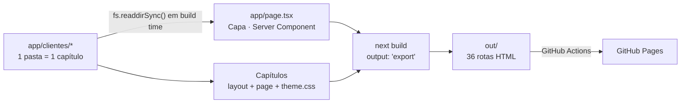
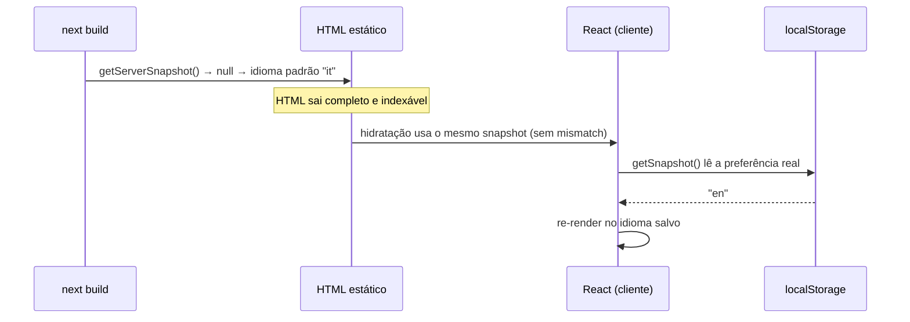

# Portfólio de Projetos Web — Gustavo Miguel Nicolodi


Hub de portfólio construído como um livro: a home é a **capa** e cada projeto em
`app/clientes/` é um **capítulo** navegável. Todos vivem num único projeto Next.js
e são publicados juntos como site estático.

Cada capítulo é uma vertical isolada — tema, tipografia, conteúdo e (quando
aplicável) i18n próprios — para que um projeto possa evoluir sem tocar nos outros.

A capa (`app/page.tsx`) descobre os capítulos em tempo de build lendo o diretório
`app/clientes/` no sistema de arquivos. Adicionar uma pasta é suficiente para o
projeto aparecer no índice: não há registro manual, lista hardcoded ou CMS.

Atualmente: **14 projetos, 36 rotas estáticas.**

## Composição do código

| Linguagem | Arquivos | Linhas | Share |
| --- | ---: | ---: | ---: |
| TypeScript / TSX | 76 | 11.270 | ~89% |
| CSS | 13 | 966 | ~8% |
| Markdown | 3 | 215 | ~2% |
| JSON / YAML / MJS | 8 | 219 | ~1% |

Tudo em TypeScript `strict`, sem `any` e sem `@ts-ignore` no código de aplicação.
Exclui `node_modules/`, lockfile e artefatos de build.

## Stack

| Camada | Tecnologia |
| --- | --- |
| Framework | Next.js 16 (App Router, React Server Components) |
| UI | React 19, Tailwind CSS 4, shadcn/ui (estilo `radix-nova`), Radix UI |
| Ícones | Remix Icon (`@remixicon/react`) |
| Carrossel | Embla Carousel |
| Tipografia | `next/font/google` nas demos mais recentes; `<link>` para Google Fonts nas demais |
| Build | Static export (`output: 'export'`) |
| Deploy | GitHub Pages via GitHub Actions |
| Qualidade | TypeScript strict, ESLint (`core-web-vitals` + `typescript`), Prettier + `prettier-plugin-tailwindcss` |
| Gerenciador | pnpm |

## Arquitetura

Não há banco, API ou runtime de servidor. O sistema é uma **pipeline de build**:
o filesystem é a fonte de verdade, o Next.js resolve tudo em tempo de compilação
e o resultado é HTML puro.



**Consequências dessa escolha:**

- Custo de hospedagem zero e superfície de ataque mínima — não há servidor.
- Adicionar um projeto é criar um diretório; a capa se atualiza sozinha no
  próximo build, sem lista hardcoded nem CMS.
- Em troca, a listagem é congelada no export: mudanças em `app/clientes/`
  exigem novo build para aparecer.

### Camadas de renderização

| Camada | Onde executa | Exemplos |
| --- | --- | --- |
| Server Components | Build time | `app/page.tsx` (leitura do FS), páginas de conteúdo estático |
| Client Components | Navegador | Providers de idioma, filtros de cardápio, menu mobile |
| Estilo | Build time | Tailwind 4 (CSS-first) + `theme.css` com variáveis por marca |

## Estrutura

```text
app/
├── layout.tsx              # Capa do livro: metadata, autoria, fontes globais
├── page.tsx                # Índice de capítulos (leitura do FS em build time)
├── globals.css             # Tokens Tailwind 4 + reset
└── clientes/
    ├── <slug>-demo/
    │   ├── layout.tsx      # metadata SEO + provider de idioma + escopo de tema
    │   ├── page.tsx        # landing da demo
    │   ├── theme.css       # variáveis CSS da marca
    │   ├── LanguageContext.tsx  # i18n IT/EN (quando aplicável)
    │   └── menu/page.tsx   # rota interna (cardápio, galeria, etc.)
    └── ...
components/ui/              # Primitivos shadcn/ui compartilhados
lib/utils.ts                # helper `cn`
css.d.ts                    # declaração de módulo para imports de CSS
```

### Isolamento entre capítulos

Cada projeto é autocontido por decisão de arquitetura: conteúdo, dicionário de
traduções e variáveis de tema vivem dentro da própria pasta. Isso evita que o
ajuste de uma marca quebre outra e permite remover um projeto apagando um
diretório. O preço é duplicação intencional entre os `LanguageContext.tsx` de
projetos diferentes — trade-off escolhido a favor do isolamento.

### Autoria nos metadados

O layout raiz define um `title.template` (`%s | Gustavo Miguel Nicolodi`), então
cada capítulo carrega a autoria no `<title>` sem precisar repeti-la:

```text
48 Sedie | Authentic Italian Dining Experience | Gustavo Miguel Nicolodi
```

### i18n e hidratação

Os capítulos bilíngues (IT/EN) persistem o idioma em `localStorage` — que não
existe em tempo de build. A abordagem ingênua (`useState` + `useEffect`, com
`if (!mounted) return null` para evitar mismatch) tem um custo caro no export
estático: o HTML sai **vazio**, e todo o conteúdo passa a depender de JavaScript.

A solução aqui usa
[`useSyncExternalStore`](https://react.dev/reference/react/useSyncExternalStore)
com *server snapshot*:



A troca de idioma grava em `localStorage` e dispara um `CustomEvent`, que o
`subscribe` escuta — mantendo store e provider sincronizados na mesma aba, e o
evento nativo `storage` cobrindo abas diferentes.

Resultado mensurável: as capas dos capítulos passaram a servir de 19 a 33 KB de
HTML real, contra uma página em branco antes da correção.

## Executando localmente

```bash
pnpm install
```

```bash
pnpm dev
```

Disponível em `http://localhost:3000`. A capa lista todos os capítulos encontrados
em `app/clientes/`.

### Scripts

| Script | Efeito |
| --- | --- |
| `pnpm dev` | Servidor de desenvolvimento (Turbopack) |
| `pnpm build` | Export estático para `out/` |
| `pnpm start` | Serve a build de produção |
| `pnpm lint` | ESLint |
| `pnpm typecheck` | `tsc --noEmit` |
| `pnpm format` | Prettier sobre `**/*.{ts,tsx}` |
| `pnpm dev:vinext` / `pnpm build:vinext` | Runtime alternativo Vite + [vinext](https://www.npmjs.com/package/vinext) (experimental) |

> `pnpm typecheck` depende de `next-env.d.ts`, gerado por `next dev`/`next build`.
> Em um clone limpo, rode `pnpm build` (ou `pnpm dev`) antes do typecheck.

## Variáveis de ambiente

| Variável | Uso |
| --- | --- |
| `NEXT_PUBLIC_BASE_PATH` | Prefixo de rota quando servido em subpath (GitHub Pages). Aplicado em `next.config.mjs` e `vite.config.ts`. |
| `NEXT_PUBLIC_SITE_URL` | Origem absoluta usada em `metadataBase` para Open Graph/Twitter. |

Ambas são preenchidas automaticamente pelo workflow de deploy a partir dos outputs
de `actions/configure-pages`. Em desenvolvimento, os padrões (`/` e
`http://localhost:3000`) são suficientes.

## Deploy

`.github/workflows/nextjs.yml` roda a cada push em `main`/`master` (ou via
`workflow_dispatch`):

1. `pnpm install --frozen-lockfile`
2. `pnpm build` com `NEXT_PUBLIC_BASE_PATH` e `NEXT_PUBLIC_SITE_URL` derivados do Pages
3. `touch out/.nojekyll` para o GitHub Pages não processar o output com Jekyll
4. Upload de `out/` e publicação via `actions/deploy-pages`

## Adicionando um capítulo

1. Crie `app/clientes/<slug>-demo/`.
2. Adicione `layout.tsx` exportando `metadata` (título e descrição próprios) e
   envolvendo `children` no escopo de tema.
3. Adicione `theme.css` com as variáveis CSS da marca e importe-o no layout.
4. Crie `page.tsx` e as rotas internas necessárias.
5. Rode `pnpm build` — a capa passa a listar o projeto automaticamente.

## Limitações conhecidas

- Export estático com `images.unoptimized: true`: vários capítulos consomem
  imagens externas (Unsplash) via ``, o que gera avisos
  `@next/next/no-img-element`. São aceitos conscientemente — sem servidor Next,
  não há otimização de imagem.
- A regra `@next/next/no-page-custom-font` acusa os `<link>` de Google Fonts dos
  capítulos que ainda não migraram para `next/font`. Migração pendente, não
  bloqueante.
- `app/page.tsx` lê o filesystem em build time; a listagem é congelada no export.

## Autor

**Gustavo Miguel Nicolodi** — Engenheiro de software, Araucária/PR.

Full-stack em TypeScript, Node.js, Next.js, NestJS, PostgreSQL/Prisma e AWS, com
atuação também em DevOps (Docker, pipelines de deploy, monitoramento). Cofundador
da FCX Solutions. Cursando ADS na PUCPR; graduado em Engenharia Mecânica pela
UNIFACEAR.

Os projetos deste repositório foram concebidos, implementados e publicados por
mim, do design de interface ao pipeline de deploy.

- GitHub: [@BossBurgues](https://github.com/BossBurgues)

## Licença

Código e conteúdo proprietários — todos os direitos reservados. As marcas,
nomes comerciais e conteúdos representados nos capítulos pertencem aos
respectivos titulares e aparecem aqui apenas em caráter demonstrativo.
